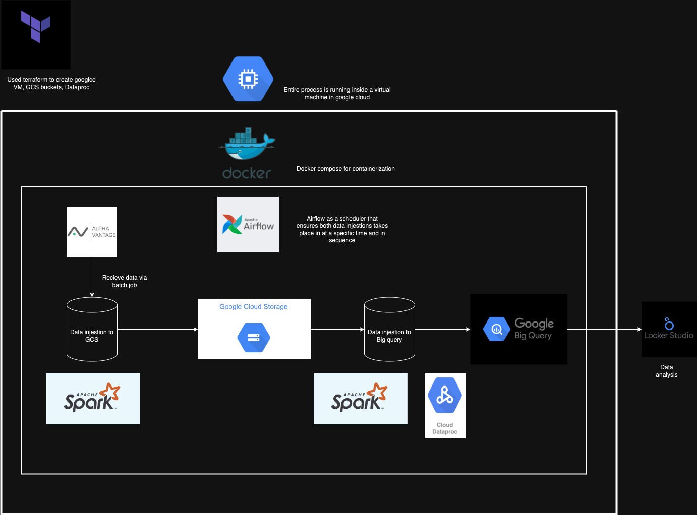
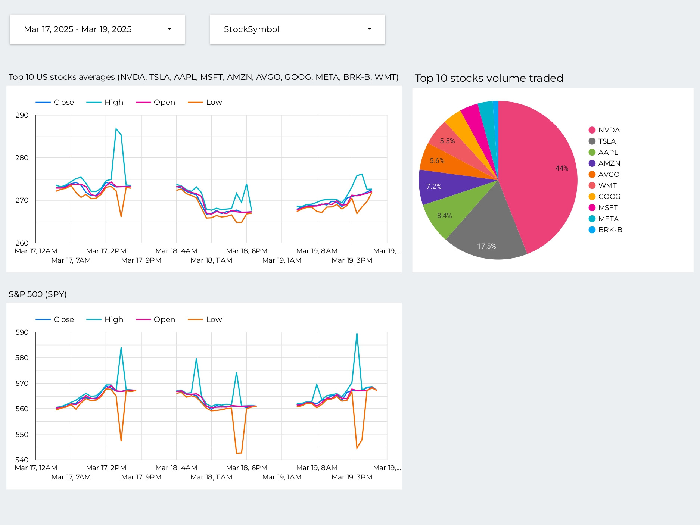

# Stock Data Injestion
### A simple project that does basic stock data injestion for the top 10 stocks in the US stock market by market cap

**Just a note that this current project is running as a free tiered subscription to Google Cloud. Access will end on June 2 2025, so if the code is still working, it will stop working when the free tier access end.**

Contact me: fabianbryantphng@gmail.com

In this demo project:
1. Data is obtained via a GET request from the TIME_SERIES_INTRADAY api which can be found [here](https://www.alphavantage.co/documentation/). Data is obtained via batch request.
2. The script is scheduled by *airflow*(a scheduler that runs tasks) to run a few hours after the stock market closes. This allows the API some time for the data to be loaded. Will injest the data at 30 mins interval.  
3. Data in transformed and then uploaded to a GCS bucket via spark.
4. The next script then runs through *airflow* which uploads the day's data from the GCS bucket to BigQuery using Google's dataproc spark.
5. Looker studio is used to extract data and provide some data visualization.

### Process mapping:

- Terraform used to create a linux VM instance, GCS bucket and Dataproc clusters.
- Sandboxing via a VM, docker compose, python venv.
- Techstack:
    1. Airflow
    2. Spark
    3. Docker
    4. Google Cloud
    5. Terraform
    6. Looker Studios

### Data Visualization:
Dashboard can be found [here](https://lookerstudio.google.com/reporting/ce71aea8-07a7-4c67-8051-f9412e5136f5)

- Provides a snap shot of how the top 10 stocks in the US market (provided in the csv [here](https://github.com/fabianono/Stock_Data_Injestion/blob/master/others/stocks_symbol.csv)) impacts the S&P500 (SPY) in a selected time period.
- Also shows the traded volume of the top 10 US stocks in the selected time period.
- Some data analysis that can be done:
    - The S&P500 follows a similar pattern to the top 10 stocks in the US stock market
    - NVDA is the largest trading stock on the US market in the current period daily

### How to run:
1. Go to [alphavantage](https://www.alphavantage.co/support/#api-key) to generate your free keys. Generate at least 2 as there is a limit placed on api calls in the free tier. Add the keys to a .env file
2. Get a service account key from Google Cloud and place it as ./keys/sa_adminadmin.json. You need to give the service account these roles:       
    - ApiGateway Admin
    - BigQuery Admin
    - BigQuery Data Editor
    - BigQuery Job User
    - Compute Admin
    - Dataproc Administrator
    - Service Account User
    - Service Usage Admin
    - Storage Admin
    - Storage Object Admin
    - Storage Object Creator
4. Run the terraform file. A storage bucket and a bigquery database should be created. (You can set up this project in a VM as well by adding a branch and pulling it from github.)
5. Replace "adminadmin@dezoomcamp-project2025.iam.gserviceaccount.com" in scripts/airflowscheduler_startup.sh with your own service account details to connect to Google Cloud from the *airflow* container.
6. Run docker compose up and you should be good to go!

