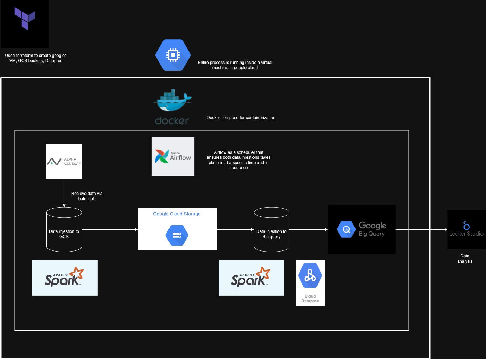

# Stock Data Injestion
### Basic stock data injestion for the top 10 stocks in the US stock market by market cap

**Just a note that this current project is running as a free tiered subscription to Google Cloud. Access will end on June 2 2025, so if the code is still working, it will stop working when the free tier access end.**

In this project:
1. Data is obtained via a GET request from the TIME_SERIES_INTRADAY api which can be found [here](https://www.alphavantage.co/documentation/). 
2. The script is scheduled by *airflow* to run an hour after the stock market closes, which is 8am where I am residing. Will injest the data at 30 mins interval.
3. The data is then uploaded to a GCS bucket via spark.
4. The next script then runs through *airflow* which uploads the day's data from the GCS bucket to BigQuery using Google's dataproc spark.
5. Looker studio is used to extract and provide some data visualization.

### Process mapping:

- Terraform used to create VM instance, GCS bucket, Dataproc clusters
-  Sandboxing via a VM, docker compose, python venv

### Data Visualization: